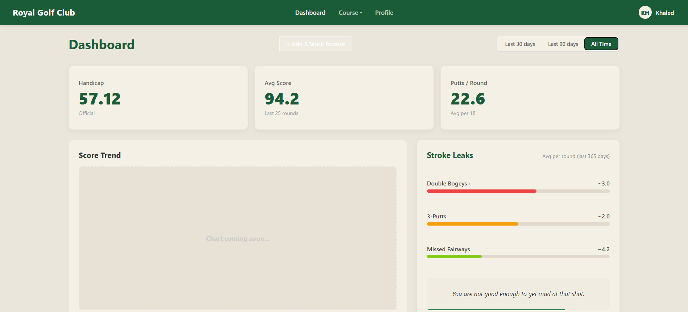
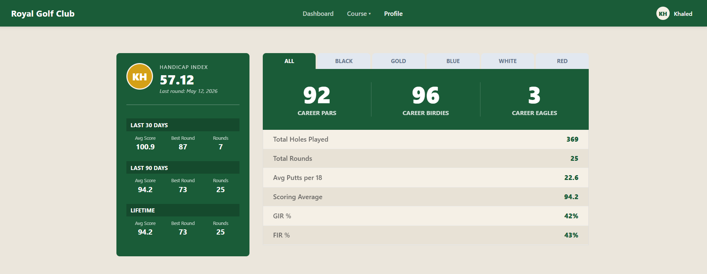
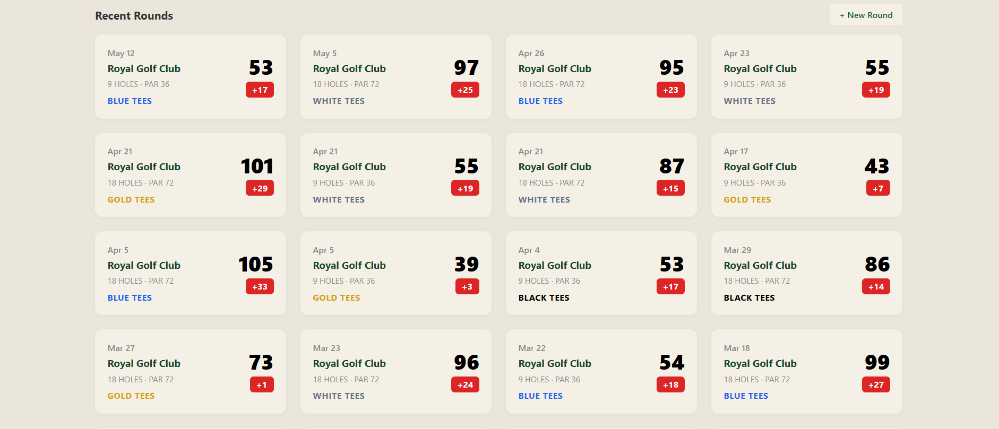
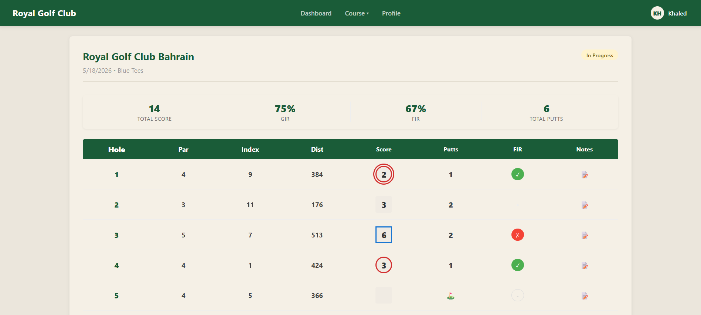
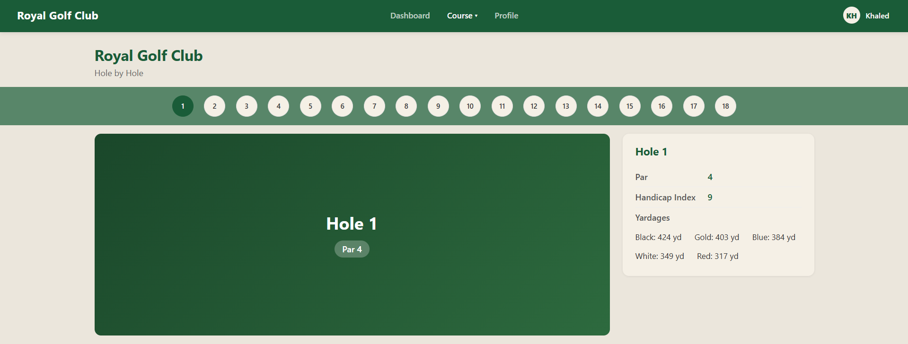
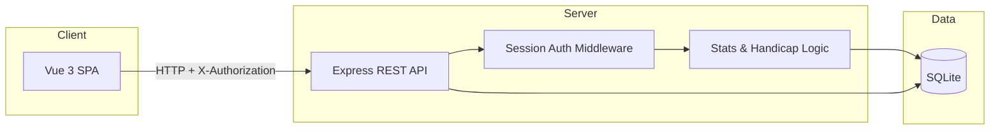

# Royal Golf Club Performance Tracker

A golf performance analytics platform for logging rounds, tracking scoring trends, and surfacing actionable statistics.

Built around the course data and workflow of **Royal Golf Club Bahrain**.

---

## Overview

Royal Golf Club Performance Tracker is a full-stack web application for serious recreational golfers who want more than a scorecard photo. Users log 9 or 18-hole rounds hole-by-hole, then review aggregated performance on a career dashboard and profile.

The platform is designed around **golf performance analysis and statistics tracking**, with course-specific context for Royal Golf Club Bahrain (official pars, handicap indices, and multi-tee yardages).

**Development focus:** backend architecture, database design, analytics logic, REST API development, and dashboard systems. The frontend delivers an interactive, desktop-first experience for round entry and stat review.

---

## Key Features

- **Round tracking & score history**: Create rounds, enter scores hole-by-hole, finalize, view history, and open past rounds for review or edits
- **Career performance dashboard**: Handicap index, average score, putts per round, and time-filtered views (30/90/All time)
- **Lifetime & period statistics**: Profile sidebar for last 30 days, last 90 days, and lifetime (avg score, best round, rounds played)
- **Tee-based performance tracking**: Filter career stats by tee (Black, Gold, Blue, White, Red) on the profile page
- **Score aggregation & analytics**: Server-side calculation of GIR%, FIR%, stroke leaks (3-putts, double bogeys+, missed fairways), and scoring totals
- **Round-by-round analysis**: Per-round scorecard with putts, fairway hit/miss, hole notes, and live GIR/FIR summaries
- **Interactive dashboard UI**: Stat cards, stroke-leaks panel, rotating tips, and recent-rounds grid with score-to-par badges
- **User profiles & authentication**: Register, login, session tokens, and personalized profile with handicap display
- **Course reference (hole-by-hole)**: Browse all 18 holes with par, handicap index, and yardages by tee
- **Hole-level detail on entry**: Strokes, putts (0-4, capped by score), FIR toggle (par 4+), and per-hole notes
- **9-hole normalization**: 9-hole rounds are projected to 18-hole equivalents in averages for fair comparison
- **Visual score indicators**: Shape-coded scores (e.g. birdie circles, bogey squares) on the live scorecard

**Partial / planned**

- **Score trend chart**: Dashboard placeholder (“Chart coming soon”); data pipeline exists via `/my/stats`
- **Full course scorecard view**: `/course/scorecard` route exists; UI not yet implemented

---

## Tech Stack


| Layer                 | Technologies                                                                                |
| --------------------- | ------------------------------------------------------------------------------------------- |
| **Frontend**          | Vue 3, Vite, Vue Router, vanilla CSS (component-scoped + global theme tokens)               |
| **Backend**           | Node.js, Express                                                                            |
| **Database**          | SQLite (`sqlite3`): file-based, auto-created on first run                                   |
| **Authentication**    | Custom session tokens (`X-Authorization` header), PBKDF2 password hashing (SHA-512, salted) |
| **Tools / libraries** | Joi (request validation), Morgan (HTTP logging), CORS, body-parser, Nodemon (dev)           |


---

## Screenshot

### Dashboard

Performance dashboard showing handicap, scoring stats, putting performance, stroke leak analysis, and round filters.



### Career Profile

Career profile showing long-term golf statistics, handicap tracking, tee-based filters, and lifetime performance metrics.



### Recent Rounds

Scrollable round history on the home dashboard: date, course, holes played, tee color, total score, and score-to-par badges. Cards link into full round detail for review or edits.



### New Round (manual entry)

Start-round flow at `/new-round`: pick date, 9 or 18 holes, and tee, then enter the live scorecard. This is the primary **manual entry** path before saving hole-by-hole scores, putts, FIR, and notes.



### Hole by Hole (coming soon)

Course explorer for Royal Golf Club: par, handicap index, and yardages per tee for each hole.



---

## System Architecture

The application follows a classic three-tier flow: the Vue SPA calls a REST API; Express handles auth and business logic; SQLite persists users, rounds, and hole-level data. Analytics are computed in the controller/model layer at request time (aggregations over `rounds` and `hole_scores`).




| Step                | Responsibility                                                     |
| ------------------- | ------------------------------------------------------------------ |
| **Frontend**        | Routing, forms, scorecard UI, dashboard/profile presentation       |
| **Express API**     | Validation (Joi), auth, CRUD for rounds/holes, stat endpoints      |
| **Database**        | Relational storage; seeded course, tees, and hole definitions      |
| **Analytics layer** | Handicap, stroke leaks, GIR/FIR, career splits, 9-hole equivalents |


---

## Core Systems

### Career Statistics (`/my/profile/v2`)

Aggregates all **completed** rounds for the authenticated user. Returns:

- **Sidebar buckets**: Last 30 days, last 90 days, lifetime: avg score (18-hole equivalent), best round, rounds played
- **Tee tabs**: Same metrics filtered by tee ID (Black → Red)
- **Deep dive**: Career pars / birdies / eagles, total holes, avg putts, GIR%, FIR%

GIR is calculated when putts are recorded: `(strokes - putts) <= (par - 2)`. FIR applies only to par 4+ holes with an explicit hit/miss value.

### Round Tracking


| Stage        | Behavior                                                                      |
| ------------ | ----------------------------------------------------------------------------- |
| **Start**    | `POST /rounds`: 9 or 18 holes, course + date                                  |
| **Entry**    | `PATCH /rounds/:id/hole/:n`: Upsert strokes, putts, par, notes, `fairway_hit` |
| **Complete** | `POST /rounds/:id/finalize`: Set total score and `completed` status           |
| **Review**   | `GET /rounds/:id`: Round metadata + all hole scores                           |


### Analytics Dashboard (`/my/stats`)

Query param `days` (default `30`) filters completed rounds. Response includes:

- Average score (9-hole scores ×2 for equivalence)
- Average putts per round
- Round count
- **Stroke leaks** (per-round averages): 3-putts, double bogeys+, missed fairways

Handicap is served separately via `GET /my/handicap` (last 10 completed rounds, simplified index formula). Dashboard shows **Provisional** until 10 rounds are logged.

---

## API Overview

Protected routes require header: `X-Authorization: <session_token>`


| Method   | Endpoint                            | Auth | Description                                                    |
| -------- | ----------------------------------- | ---- | -------------------------------------------------------------- |
| `GET`    | `/`                                 | No   | Health check (`{ status: "Alive" }`)                           |
| `POST`   | `/register`                         | No   | Create account                                                 |
| `POST`   | `/login`                            | No   | Authenticate; returns `session_token`                          |
| `POST`   | `/logout`                           | Yes  | Invalidate session                                             |
| `GET`    | `/user/:user_id`                    | No   | Public user lookup by ID                                       |
| `GET`    | `/my/info`                          | Yes  | Current user profile fields                                    |
| `POST`   | `/rounds`                           | Yes  | Start a new round                                              |
| `GET`    | `/rounds`                           | Yes  | List user rounds                                               |
| `GET`    | `/rounds/:roundId`                  | Yes  | Round detail + hole scores                                     |
| `PATCH`  | `/rounds/:roundId/hole/:holeNumber` | Yes  | Update a single hole                                           |
| `POST`   | `/rounds/:roundId/finalize`         | Yes  | Complete a round                                               |
| `DELETE` | `/rounds/:roundId`                  | Yes  | Delete a round                                                 |
| `GET`    | `/my/handicap`                      | Yes  | Handicap index + round count                                   |
| `GET`    | `/my/stats?days=30`                 | Yes  | Dashboard aggregates & stroke leaks                            |
| `GET`    | `/my/profile`                       | Yes  | Profile stats (legacy handler; superseded in code by v2 logic) |
| `GET`    | `/my/profile/v2`                    | Yes  | Career sidebar, tee tabs, last played                          |
| `GET`    | `/course/details`                   | Yes  | Course tee list                                                |
| `POST`   | `/debug/seed`                       | Yes  | Generate mock rounds (`{ count }`) for development             |


**Base URL (local):** `http://localhost:3333`

---

## Database Overview

SQLite schema is initialized in `backend/database.js`. Core entities:


| Table           | Purpose                                                  |
| --------------- | -------------------------------------------------------- |
| **users**       | Accounts, salted password hash, `session_token`          |
| **courses**     | Course metadata (seeded: Royal Golf Club Bahrain)        |
| **tees**        | Tee names, rating, slope (Black, Gold, Blue, White, Red) |
| **hole_defs**   | Per-hole par, handicap index, yardages by tee            |
| **rounds**      | User round: date, holes played, tee, total score, status |
| **hole_scores** | Per-hole strokes, putts, par, notes, `fairway_hit`       |


**Relationships**

```
users 1──* rounds *──1 courses
rounds *──1 tees (optional)
rounds 1──* hole_scores
hole_defs ── course_id + hole_number (reference data)
```

**Aggregation logic**

- Stats join `rounds` → `hole_scores` for completed rounds only
- Putts summed per round via subquery
- Stroke leaks iterate hole rows in application code
- No separate statistics tables - metrics are computed on read

---

## Installation

### Prerequisites

- Node.js 18+ recommended
- npm

### 1. Clone the repository

```bash
git clone https://github.com/khaledhusain/rgc-score-tracker
cd rgc-score-tracker
```

### 2. Backend

```bash
cd backend
npm install
npm run dev
```

Server runs at **[http://localhost:3333](http://localhost:3333)**. SQLite database file `db.sqlite` is created automatically with seeded course data.

### 3. Frontend

```bash
cd frontend
npm install
npm run dev
```

App runs at **[http://localhost:5173](http://localhost:5173)**.

### 4. API URL

The frontend points to `http://localhost:3333` in `frontend/src/services/api.js`. Update `API_BASE` if your backend port changes.

### 5. Production build (optional)

```bash
cd frontend && npm run build && npm run preview
cd backend && npm start
```

---

## Development Notes

- **Local database**: `backend/db.sqlite` is gitignored; delete it to reset all data and re-seed on next server start
- **Mock data**: Log in and use **+ Add 5 Mock Rounds** on the dashboard (calls `POST /debug/seed`) to populate analytics with randomized 9/18-hole rounds, putts, and fairway data
- **API testing**: Use Postman, Insomnia, or `curl` with `X-Authorization` after login
- **Analytics development**: Primary logic lives in `round.server.controllers.js` (`getDashboardStats`, `getProfile`) and `round.server.models.js`
- **Scalability**: Current design suits single-course, single-server deployment; moving to PostgreSQL, caching stat snapshots, and background jobs would be natural next steps for heavier usage

---

## Future Improvements

- Official **WHS handicap** calculations and score differential history
- **Shot tracking** (distances, miss patterns, club selection)
- **Advanced charts**: Score trend, putting averages, FIR/GIR over time
- Improved **mobile responsiveness**
- **Multi-course** support beyond Royal Golf Club Bahrain
- **Cloud deployment** (containerized API + managed database)
- **Social & comparison** features: leaderboards, shared rounds, friend stats
- Full **scorecard PDF-style view** and Pinia-based global state
- Eclectic/personal-best-per-hole display (backend query exists; not yet in UI)

---

## Project Status

This project is an **actively evolving golf analytics and performance tracking platform**, currently developed as a **portfolio project**. Core round logging, dashboard analytics, and career profiling are functional; visualization and course scorecard views remain in progress.

